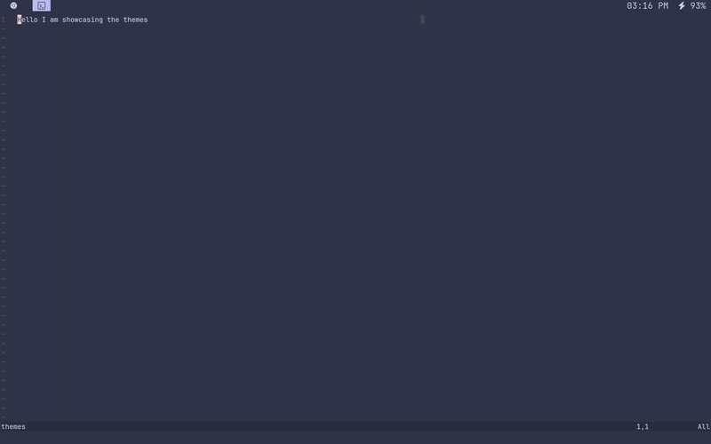

# Aesthetics & Themes

You can apply themes by launching the application launcher (`super+d`) and running `theme-select-monos`. Out of the box, we have 3 themes:

- **Default Dark**: Catppuccin Frappé — The default theme when you install Monos.
- **Default Light**: Catppuccin Latte — For people who like to burn their eyes.
- **Barney**: A theme based on your favorite dinosaur (the theme used on this website).

## How to Make Your Own Theme

1. Navigate to `~/.config/monos-themes/`.
2. Create a directory with the name of the theme you want to create.
3. Look at how the `default-dark` theme is implemented on [GitHub](https://github.com/dantevazquez/monos/tree/main/themes/default-dark){ target="_blank" }. You can copy a theme and replace the color codes with your desired colors. You will make a theme for each file in the linked directory. You may also add a file of your own. Every file in this directory will be copied to `~/.config/monos-themes/current/`. Therefore, in your program's config, you can point the theme to that directory.
4. Once you complete your theme, it will appear when you run `theme-select-monos`.

